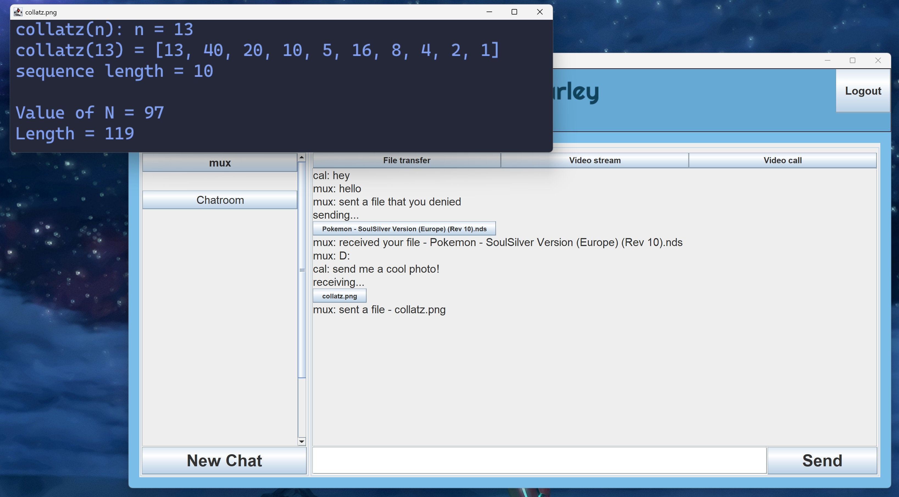

# Parley

## My group's project for: CS313, Networking and Concurrency

This is the final submission of our group project for CS313: Networking and Concurrency, completed during our studies at the University of Strathclyde.

### Fellow Contributors

- [Calum Cardownie](https://github.com/calumvc)
- [Ethan Midgley](https://github.com/ethanmidgley)
- Kieran Ballard
- [Fraser Patrick](https://github.com/fraserpatrick)
- Moray Blackwood

### UI Previews

#### Client login screen

#### Chatroom view

#### Update username

#### Handshake for Peer to Peer communication (files, video streams, webcams)

#### Sending files

#### Receiving files

#### File selection

#### Streaming files

#### Live Video call

